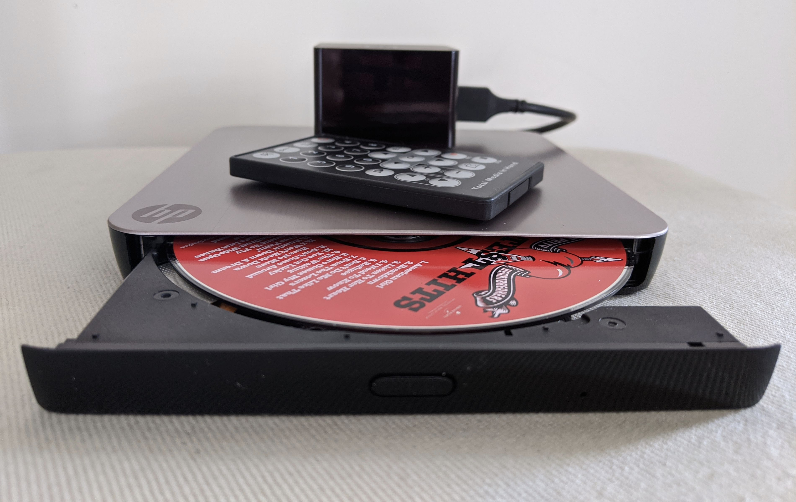

Bogan's Media Jukebox
=====================

A Mopidy-based media player built from sh*t and bricks.

Features
--------

* Plays music from:
    * Audio CDs and DVDs.
    * Online radio stations.
    * DLNA servers on your LAN.
    * [Yandex.Disk](https://disk.yandex.com) cloud storage.
    * Any other source supported by Mopidy.
* Controllable using:
    * IR remote control.
    * MPD client, e.g. [M.A.L.P.](https://gitlab.com/gateship-one/malp)
    * Any other client supported by Mopidy.
* Outputs audio via analog and Bluetooth connections, potentially supports AirPlay and S/PDIF.

Hardware
--------

* [Orange Pi Zero](http://www.orangepi.org/orangepizero/) with expansion board.
* HP GT30L external DVD drive.
* Bluetooth v4.0 USB dongle (CSR8510 based).
* IR remote control (Total Media in Hand).
* USB 2.0 Y power cable.

Software
--------

* [Armbian](https://www.armbian.com/) for Orange Pi Zero.
* Mopidy with extensions.

Installation and configuration are done using Ansible script.
